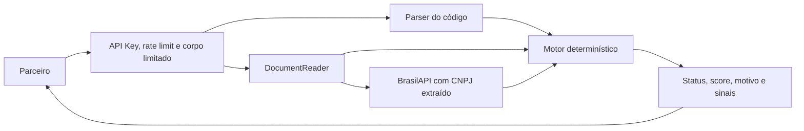

# ScamShield

API B2B de análise de risco documental para boletos. O banco, fintech ou marketplace chama o serviço antes do pagamento. A IA extrai campos; regras determinísticas verificam inconsistências; o parceiro aplica sua própria política.

**MVP funcional:** API, demonstração web, nove cenários reproduzíveis, integrações configuráveis, testes e Docker. A API informa risco e **nunca bloqueia pagamentos**. SAFE significa consistência nas verificações disponíveis, não confirmação de autenticidade ou do recebedor efetivo.

## Executar a demonstração

Com Docker e Docker Compose instalados, na raiz do projeto:

```sh
docker compose up --build
```

Abra [a demonstração](http://localhost:8000), [Swagger](http://localhost:8000/docs) ou [OpenAPI JSON](http://localhost:8000/openapi.json). O modo padrão é `demo`. Em demo a chave de acesso **já vem preenchida na tela**: a página a obtém de `/demo/access`, que devolve a credencial configurada na própria instância — por padrão `scamshield-demo-local`, **pública e exclusiva de teste**. Ela não funciona em modo `live`.

Selecione um cenário e clique em **Analisar boleto**. Para percorrer o envio de arquivo, abra **Baixar os boletos de teste**, baixe um PDF (ou todos, em `.zip`) e envie no campo de upload. Documentos desconhecidos em demo retornam WARNING com o sinal `DOCUMENT_UNKNOWN_DEMO_DOCUMENT`; o fake nunca finge ter lido um arquivo arbitrário. Nesse caso a tela mostra **"Documento não reconhecido nesta demonstração"** em vez de um score, para que o peso 10 não seja lido como veredito de risco sobre o arquivo enviado — a resposta da API não muda, e o JSON completo continua em "Detalhes para auditoria". Toda resposta indica `details.mode`.

O primeiro build baixa dependências. Depois, o fluxo demonstrativo e a tela funcionam sem serviços externos. O Swagger padrão do FastAPI carrega assets de CDN; a tela principal e `/openapi.json` não dependem disso.

No Windows deste workspace, o Python 3.11 já está preparado:

```powershell
.\Start-MVP.ps1
```

Em outra máquina, o script cria `.venv` com `py -3.11` e instala dependências. Alternativamente:

```powershell
py -3.11 -m venv .venv
.\.venv\Scripts\python.exe -m pip install -r requirements.lock
.\.venv\Scripts\python.exe run.py
```

Linux/macOS:

```sh
python3.11 -m venv .venv
.venv/bin/python -m pip install -r requirements.lock
.venv/bin/python run.py
```

O launcher usa `127.0.0.1:8000`; `python run.py --port 8001` escolhe outra porta. Em hospedagem que atribui a porta em tempo de execução, a variável `PORT` é respeitada e o container não fixa `--port`. O Compose publica apenas no loopback. Usar **um processo/worker**: limites em memória não se distribuem entre réplicas.

## Contrato e requisições

`POST /v1/analise`, header `X-API-Key`, corpo JSON com `linha_digitavel`, `documento`, ou ambos:

```json
{
  "linha_digitavel": "00191157500000150001234567890123456789012345",
  "documento": {
    "mime_type": "application/pdf",
    "base64": "BASE64_DO_ARQUIVO"
  }
}
```

`BASE64_DO_ARQUIVO` é apenas um marcador. Para uma chamada executável, use a fixture completa:

```sh
curl -X POST http://localhost:8000/v1/analise \
  -H 'X-API-Key: scamshield-demo-local' \
  -H 'Content-Type: application/json' \
  --data-binary @demo/requests/amount_danger.json
```

No PowerShell, use `curl.exe` em uma linha. A coleção [demo/requests.http](demo/requests.http) funciona com REST Client do VS Code; os nove JSONs prontos estão em `demo/requests/`.

Resposta: quatro campos comerciais e dois auxiliares no nível superior:

```json
{
  "status": "DANGER",
  "score": 60,
  "title": "Inconsistência importante no boleto",
  "explanation": "O valor informado no documento é diferente do valor do código de pagamento.",
  "details": {
    "mode": "demo",
    "rules_version": "1.0",
    "raw_score": 60,
    "signals": [],
    "limitations": ["As verificações não confirmam o recebedor efetivo do pagamento."]
  },
  "request_id": "00000000-0000-4000-8000-000000000001"
}
```

O exemplo abrevia `signals`; a resposta real inclui os sinais, fontes, pesos e contribuições. Não devolve campos extraídos, CNPJ ou nome. O ID gerado pelo servidor também aparece em `X-Request-ID`.

Formatos: JPG, PNG ou PDF em base64; até **5 MiB** por arquivo, **7 MiB** de corpo, PDF até **3 páginas**, imagem até **20 milhões de pixels**. Um boleto por análise. Arquivo protegido, ilegível ou sem leitura suficiente gera WARNING. URL de arquivo, multipart, áudio e QR PIX não são aceitos.

Cobrança: linha de 47 dígitos ou os 44 dígitos do barcode, com espaços, pontos e hífens permitidos. Arrecadação/convênio reconhecido gera WARNING por escopo não suportado. **Linha sem documento fica em WARNING**, pois não permite conferir o beneficiário.

| HTTP | Significado |
| --- | --- |
| 200 | Análise, inclusive SAFE/WARNING/DANGER e degradação de fontes |
| 400 / 408 | Envio inválido/interrompido ou timeout de upload |
| 401 | API Key ausente ou inválida |
| 413 / 415 / 422 | Tamanho, tipo de corpo ou contrato inválido |
| 429 | Rate limit ou capacidade simultânea esgotada; inclui Retry-After |
| 500 | Erro interno inesperado sanitizado; falhas de dependências viram sinais |

## Cenários sem rede

| Fixture | Status | Score |
| --- | --- | ---: |
| `safe` — informações compatíveis | SAFE | 0 |
| `trade_name` — nome fantasia compatível | SAFE | 0 |
| `name_warning` — nome diferente | WARNING | 25 |
| `intermediary` — intermediário conhecido | WARNING | 10 |
| `unreadable` — leitura incompleta | WARNING | 10 |
| `registry_timeout` — consulta indisponível | WARNING | 10 |
| `amount_danger` — valor divergente | DANGER | 60 |
| `registry_danger` — cadastro simulado baixado | DANGER | 60 |
| `invalid_dv` — DV inválido e comparações impedidas | DANGER | 70 |

PDFs em `src/scamshield/data/demo/`, marcados **SEM VALOR DE PAGAMENTO**. Cadastros/extrações são simulados, não avaliações reais das empresas citadas. O fake reconhece hashes exatos e usa o mesmo motor do modo live. Regenerar: `python scripts/build_demo.py`.

Com o servidor ligado: `python scripts/check_demo.py`. Use `--url http://localhost:8001` para outra porta e `SCAMSHIELD_TEST_API_KEY` se trocar a chave.

## Modo live e segredos

Copie `.env.example` para `.env`, selecione `SCAMSHIELD_MODE=live`, configure `SCAMSHIELD_API_KEYS` como JSON `{ "id-do-parceiro": "chave-aleatoria" }`, preencha `SCAMSHIELD_GEMINI_API_KEY` e escolha `SCAMSHIELD_GEMINI_MODEL`. Reinicie o serviço. Uma chave própria pode ser gerada com `python -c "import secrets; print(secrets.token_urlsafe(32))"`.

Live recusa a chave de demonstração, chaves menores que 24 caracteres e ausência de credencial/modelo. `/demo/cases`, `/demo/access`, `/demo/files/*` e `/demo/files.zip` ficam indisponíveis. Nunca versionar `.env` ou segredos reais. A credencial pública da demo não é segredo de produção.

**Uma instância em modo `demo` publica a própria chave** em `/demo/access`, para que a tela funcione sem digitação. É intencional: em demo não há serviço externo nem cota consumida, e o avaliador precisa da credencial. Por isso, **nunca configure em uma demo pública a mesma chave que será usada em `live`** — gere uma chave só para ela, ou deixe o padrão.

Atenção a um detalhe do carregamento: `SCAMSHIELD_API_KEYS` definido em `.env` e em variável de ambiente é **mesclado**, não substituído, então os dois parceiros passam a existir. Nesse caso `/demo/access` publica a chave pública `scamshield-demo-local` quando ela estiver entre eles, justamente para não expor a outra. A imagem Docker não copia `.env` (ver `.dockerignore`), de modo que na hospedagem valem apenas as variáveis da plataforma.

`GeminiReader` usa REST `models.generateContent`, arquivo inline em memória, resposta estruturada, `store: false` e modelo configurável. O prompt não pede risco, não habilita ferramentas e trata o documento como dado não confiável. A interface `DocumentReader` separa provedor e negócio.

BrasilAPI: `GET https://brasilapi.com.br/api/cnpj/v1/{cnpj}`. O adaptador seleciona identificação, razão social, nome fantasia e situação. Trata 400/404/429/5xx, timeout, transporte e resposta inválida. 429 ativa cooldown limitado conforme Retry-After, sem loop de retentativas. O leitor também trata 429 explicitamente.

O modelo em `.env.example` é exemplo da documentação consultada, não garantia de disponibilidade para toda conta. Live foi testado com transporte HTTP mockado; não houve chamada paga com credenciais do usuário.

## Arquitetura, tecnologias e dados

Python **3.11**, FastAPI, Uvicorn, HTTPX assíncrono, Pydantic, pypdf, Pillow, pytest e coverage. A tela usa HTML/CSS/JavaScript locais, sem framework ou analytics. Versões diretas estão fixadas em `pyproject.toml`; `requirements.lock` fixa também transitivas de execução.



`domain/`: parser, identificadores e **todas as regras** em `decision.py`, sem rede, arquivos ou relógio global. `services/`: prazos e descarte. `integrations/`: provedores/fakes. `http/`: contrato e proteção da entrada. `infrastructure/`: TTL e auditoria. Catálogos com fontes ficam em `src/scamshield/data/config/`, incluídos no pacote Python.

Parser/leitura usam `asyncio.gather` dentro de TaskGroup para cancelar e aguardar tarefas irmãs. **Consulta CNPJ depende da extração**, por isso começa depois. Timeouts: leitura 2,8 s, cadastro 1,2 s, análise 4,5 s, upload separado de 15 s. A meta inferior a 5 s após upload não é SLA. Inspeção de PDF/imagem é síncrona; limites de arquivo não garantem tempo constante para todo conteúdo malformado.

Não há banco de dados, histórico de transações, Redis, fila ou consulta de boleto registrado. BrasilAPI usa Minha Receita, não confirmação direta em tempo real na Receita. CNPJ numérico/alfanumérico tem DV validado. CPF é reconhecido, mas não consultado. VirusTotal/links, áudio, PIX, OAuth2 e mTLS são roadmap.

## Régua de risco 1.0

Aplicar o **maior peso por grupo**, somar os grupos e limitar a 100. Score é política documentada, **não probabilidade de fraude**. Cada sinal informa `weight`; só o vencedor do grupo recebe `applied_weight`. `raw_score` mostra a soma anterior ao teto.

| Grupo | Sinal | Peso | Isoladamente |
| --- | --- | ---: | --- |
| cadastro | Cadastro nulo, inapto ou baixado | 60 | DANGER |
| cadastro | Cadastro suspenso ou divergência nominal | 25 | WARNING |
| cadastro | Divergência nominal com intermediário conhecido | 10 | WARNING |
| valor | Valor nominal diverge de barcode válido | 60 | DANGER |
| integridade | DV inválido no texto do parceiro | 60 | DANGER |
| vencimento | Data incompatível com os ciclos possíveis | 10 | WARNING |
| banco | Banco/logotipo incompatível | 10 | WARNING |
| incerteza | Indisponibilidade, 404, ilegibilidade ou verificação incompleta | 10 | WARNING |

Faixas: **0 = SAFE; 1–59 = WARNING; 60–100 = DANGER**. Sem sinal forte, o máximo é 55. Informação obrigatória ausente sempre pontua. Nome divergente = 25; mais valor divergente = 85; mais banco divergente = 95. Cadastro indisponível e valor divergente = 70/DANGER, mantendo os dois motivos.

O grupo de incerteza aplica um peso único, mas todos os motivos continuam visíveis. DV inválido impede outras comparações e gera aviso adicional: a fixture tem score 70. DV inválido somente na transcrição do modelo gera WARNING. Leitura de código marcada como ambígua não sustenta divergência forte de valor.

Comparar valor nominal, nunca total com encargos. O fator de vencimento reinicia em 1000 em 22/02/2025; o parser retorna datas candidatas sem escolher pelo relógio atual. Valor zero codificado significa não especificado para comparação; fator zero não vira data inventada.

Fuzzy normaliza acentos, caixa, pontuação e sufixos societários, comparando razão social/nome fantasia. Similaridade >= 0,90 para nomes acima de cinco caracteres; nomes curtos exigem igualdade normalizada. Aliases documentados por CNPJ exato são permitidos. Intermediários reduzem **somente** divergência nominal para WARNING; nunca anulam cadastro irregular, valor divergente ou DV inválido. Limiares precisam de calibração representativa.

## Privacidade e auditoria

O serviço não grava uploads, prompts, extrações ou cadastros em disco, banco ou logs. JSON é lido com limite em memória, sem `UploadFile` com spool em disco. Respostas usam `Cache-Control: no-store`. Cache cadastral TTL é **local à requisição**, limitado e limpo em `finally`; não guarda CNPJ entre chamadas. A escolha preserva o descarte e limita ganhos de cache. Entre chamadas permanecem configurações públicas, fixtures sintéticas e metadados de rate limit/cooldown.

Auditoria por allowlist: request_id, timestamp, partner_id interno, status, score, códigos de sinais e latência. Sem documento, CNPJ, nome, chave ou URL. Erros são sanitizados; logs HTTP/PDF com conteúdo e acesso Uvicorn são desabilitados no launcher.

Os `finally` da rota, serviço e adaptadores liberam referências e caches em sucesso, erro ou cancelamento. Python não garante apagar fisicamente toda cópia no heap. Compose usa filesystem somente leitura, usuário sem privilégios, limite de memória/swap e core dumps desativados. Proxies/infraestrutura também precisam evitar buffers em disco e captura de conteúdo.

**Retenção zero local não significa retenção zero no provedor.** Gemini gratuito permite uso de conteúdo/revisão humana; os termos pagos também preveem retenção limitada. `store: false` não elimina essas condições. Demonstre com dados sintéticos; documentos reais exigem modalidade contratual compatível. RAM não elimina responsabilidades de proteção de dados. [Termos do Gemini](https://ai.google.dev/gemini-api/terms).

## Testes e validação

```sh
python -m pip install -e '.[test]'
python -m pytest
```

Neste workspace: `.\.tools\test-env\Scripts\python.exe -m pytest`. A suíte cobre parser/decisão integralmente em linhas e ramos, HTTP, contratos externos mockados, degradação, limites, TTL, cancelamento e privacidade. Vetores publicados evitam validar só dados gerados pelo próprio algoritmo.

Confira [docs/validacao.md](docs/validacao.md) para resultados e limites da verificação. Fixtures não medem acurácia antifraude em produção. O container precisa ser validado em ambiente com Docker disponível.

## Equipe e contribuições

### Gabriel De Almeida Moreira

* Participação na ideação e definição da proposta da solução.
* Realização da pesquisa de validação por meio de formulário (Forms), contribuindo para a coleta de percepções e necessidades relacionadas ao problema.

### Lucas Souza Rocha

* Participação na ideação e definição da proposta da solução.
* Publicação e disponibilização do projeto em ambiente de Cloud, garantindo sua execução e acesso.
* Preparação e apresentação do pitch da solução.

### Luiz Filipe Silva Groff

* Participação na ideação e definição da proposta da solução.
* Desenvolvimento do MVP (Minimum Viable Product) da solução.
* Elaboração dos slides e do material em PDF utilizados na apresentação.


## Limitações e próximos passos

Barcode não fornece CNPJ padronizado do beneficiário. Um fraudador pode copiar dados legítimos e alterar campo livre recalculando DVs. **O MVP não confirma o recebedor efetivo**, nem consulta o registro bancário do boleto; documentos consistentes ainda podem ser fraudulentos.

Fontes gratuitas/comunitárias têm disponibilidade e cobertura limitadas. A versão comercial usaria fonte contratada e dados do parceiro para confirmar o recebedor. Fuzzy, extração, falta de histórico e latência precisam de avaliação real autorizada. Catálogo bancário parcial: ausência gera WARNING, não afirma banco inexistente.

Próximos passos: validação com parceiros, calibração, boleto registrado, fontes/retenção contratadas, rate limit distribuído, mTLS/OAuth2 e novos meios de pagamento. Riscos em [RISCOS.md](RISCOS.md) e fontes em [docs/fontes.md](docs/fontes.md).
